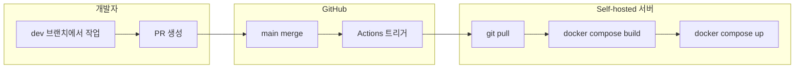

# Self-hosted CI/CD 가이드

GitHub Actions + Self-hosted Runner + Rulesets를 이용해 **main 브랜치 직접 push 금지**와 **자동 배포**를 구성한 방법을 정리한 문서입니다. 다른 환경에서도 같은 방식으로 따라 할 수 있도록 단계별로 설명합니다.

---

## 목차

1. [개요](#개요)
2. [전체 흐름도](#전체-흐름도)
3. [사전 요구사항](#사전-요구사항)
4. [1. Self-hosted Runner 설정](#1-self-hosted-runner-설정)
5. [2. Rulesets로 main 직접 push 금지](#2-rulesets로-main-직접-push-금지)
6. [3. Deploy 워크플로우](#3-deploy-워크플로우)
7. [4. 개발·배포 흐름 (다른 사람이 할 때)](#4-개발배포-흐름-다른-사람이-할-때)
8. [트러블슈팅](#트러블슈팅)

---

## 개요

| 구성 요소 | 설명 |
|-----------|------|
| **GitHub Actions** | main에 push/merge 시 자동으로 배포 워크플로우 실행 |
| **Self-hosted Runner** | GitHub 클라우드가 아닌 **우리 서버**에서 job 실행 (이 프로젝트: `agicsai-desktop`) |
| **Rulesets** | main 브랜치에 **직접 push 금지**, 반드시 **Pull Request**를 통한 merge만 허용 |
| **Deploy 워크플로우** | 서버에서 `git pull` → `docker compose build` → `docker compose up` 으로 자동 배포 |

그림으로 보면 아래와 같습니다.


> **그림 1.** 개발자 → dev 브랜치 작업 → PR → main merge → GitHub Actions가 Self-hosted Runner에서 배포 실행 → 서버 Docker 컨테이너 갱신

---

## 전체 흐름도



- **Mermaid**가 지원되는 뷰어(GitHub, VS Code 등)에서는 위 다이어그램이 렌더링됩니다.
- 텍스트만으로 흐름을 이해할 수 있도록, 아래에 동일 내용을 단계로 적었습니다.

| 단계 | 주체 | 내용 |
|------|------|------|
| 1 | 개발자 | `dev` 브랜치에서 코드 수정 후 push |
| 2 | 개발자 | `dev` → `main` 으로 **Pull Request** 생성 |
| 3 | 리뷰어/본인 | PR 승인 후 **Merge** (main에 직접 push는 Rulesets로 차단됨) |
| 4 | GitHub | main에 push/merge 발생 → **Deploy (self-hosted)** 워크플로우 자동 실행 |
| 5 | Runner(서버) | 서버의 저장소 경로에서 `git pull` → `docker compose build` → `docker compose up --force-recreate` |
| 6 | 서버 | 새 이미지로 컨테이너 재생성 → 배포 완료 |


> **그림 2.** PR merge 후 Actions → Runner → 서버에서 배포가 실행되는 순서

---

## 사전 요구사항

- **서버 1대**: Linux (이 가이드에서는 Ubuntu 기준, hostname 예: `agicsai-desktop`)
- **GitHub 저장소**: 이 프로젝트가 올라간 repo (예: `qkr7287/3d-widget-web-host`)
- **서버에 설치된 것**: Docker, Docker Compose, Git
- **배포 경로**: 서버에서 코드가 놓일 고정 경로 (예: `/home/agics-ai/github/3d-widget-web-host`)
- **계정**: GitHub repo에 대한 Admin 또는 설정 변경 권한

---

## 1. Self-hosted Runner 설정

### 1-1. Runner 다운로드 및 설치

1. GitHub 저장소 → **Settings** → **Actions** → **Runners** 이동.
2. **New self-hosted runner** 클릭.
3. OS를 **Linux**로 선택하고, 표시되는 명령어를 **서버에서** 실행합니다.


> **그림 3.** Settings → Actions → Runners → New self-hosted runner

예시 (버전/URL은 GitHub에서 안내하는 최신 값 사용):

```bash
# 서버에 runner 사용자로 로그인 (root 말고 일반 사용자 권장, 예: agics-ai)
mkdir -p /opt/actions-runner/3d-widget-web-host
cd /opt/actions-runner/3d-widget-web-host
curl -o actions-runner-linux-x64-2.xxx.x.tar.gz -L https://github.com/actions/runner/releases/download/v2.xxx.x/actions-runner-linux-x64-2.xxx.x.tar.gz
tar xzf ./actions-runner-linux-x64-2.xxx.x.tar.gz
```

### 1-2. Runner 설정 (config.sh)

아래 명령은 **반드시 root가 아닌 사용자**로 실행합니다. (예: `agics-ai`)

```bash
./config.sh --url https://github.com/qkr7287/3d-widget-web-host --token <GitHub에서_발급한_토큰>
```

- **Runner group**: Enter로 Default 선택.
- **Runner name**: Enter로 호스트명(예: `agicsai-desktop`) 또는 원하는 이름.
- **Additional labels**: 필요 시 입력, 없으면 Enter로 스킵.
- **Work folder**: Enter로 `_work` 사용.


> **그림 4.** config.sh 실행 후 "Runner successfully added" 메시지

### 1-3. 서비스로 설치 및 시작

Runner를 **서비스**로 등록하면 서버 재부팅 후에도 자동으로 올라옵니다.

```bash
# 설치 (sudo 필요)
sudo ./svc.sh install

# 시작
sudo ./svc.sh start
```

- 서비스 이름 예: `actions.runner.qkr7287-3d-widget-web-host.agicsai-desktop.service`
- **Run as user**: `agics-ai` (같은 사용자로 고정해 두면, 배포 경로 권한과 맞추기 쉬움)


> **그림 5.** `systemctl status` 로 서비스가 active(running)인지 확인

### 1-4. 배포 경로 권한

워크플로우가 **같은 서버의 고정 경로**에서 `git pull`과 `docker compose`를 실행하므로, 해당 경로의 **소유자를 Runner 사용자와 동일**하게 맞춥니다.

```bash
sudo chown -R agics-ai:agics-ai /home/agics-ai/github/3d-widget-web-host
```

- Runner가 `agics-ai`로 돌고 있다면, 위 경로도 `agics-ai` 소유여야 `git reset --hard` 시 "허가 거부"가 나지 않습니다.

### 1-5. GitHub에서 Runner 확인

- **Settings** → **Actions** → **Runners** 에서 방금 추가한 runner가 **Idle(녹색)** 으로 보이면 정상입니다.


> **그림 6.** Self-hosted runner가 Idle 상태로 표시됨

---

## 2. Rulesets로 main 직접 push 금지

main에 **직접 push**를 막고, **Pull Request를 통한 merge만** 허용하려면 **Rulesets**를 사용합니다.

### 2-1. Rulesets 생성

1. GitHub 저장소 → **Settings** → **Rules** → **Rulesets**.
2. **New ruleset** 클릭.
3. **Target**: "Branch" 선택 후, 브랜치 이름에 `main` 입력 (또는 "Include all branches" 후 나중에 main만 규칙 적용).


> **그림 7.** Rules → Rulesets → New ruleset

### 2-2. 규칙 추가: Bypass list / Branch protection

- **Rule**: "Pull request required" 또는 "Require a pull request before merging" 유형 선택.
- **main**에 대해:
  - 직접 push 차단,
  - PR이 있어야 merge 가능하도록 설정.

저장소/조직에 따라 **Branch protection rules**로만 설정할 수도 있습니다.

- **Settings** → **Branches** → **Branch protection rules** → **Add rule**.
- **Branch name pattern**: `main`.
- **Allow force pushes**: 체크 해제.
- **Allow direct pushes**: 해제하거나, "Restrict who can push" 로 특정 역할만 허용.


> **그림 8.** main 브랜치 보호: PR 필수, 직접 push 제한

### 2-3. 동작 확인

- `main`에 직접 `git push origin main` 하면 **거부**되고,
- `dev` 등 다른 브랜치에서 **PR을 만들어 main에 merge**하면 정상적으로 반영됩니다.

---

## 3. Deploy 워크플로우

배포는 **main에 push/merge**될 때만 실행됩니다. 워크플로우 파일 위치: `.github/workflows/deploy.yml`.

### 3-1. 트리거

```yaml
on:
  push:
    branches: [main]
```

- **main** 브랜치에 push(또는 PR merge로 인한 push)가 발생하면 실행됩니다.

### 3-2. 실행 위치

```yaml
runs-on: self-hosted
```

- GitHub 호스트가 아니라 **우리 서버(Self-hosted Runner)** 에서 실행됩니다.

### 3-3. 단계별 동작

| Step | 내용 | 설명 |
|------|------|------|
| **Git pull** | `git fetch origin main` 후 `git reset --hard origin/main` | 서버의 배포 경로를 **main과 완전 동일**하게 맞춤 |
| **Docker Compose build** | `docker compose build --no-cache` | 캐시 없이 새 이미지 빌드 |
| **Docker Compose up** | `docker compose up -d --force-recreate` | 기존 컨테이너를 새 이미지로 **재생성** 후 백그라운드 실행 |

실제로 실행되는 경로는 **서버의 고정 경로**입니다 (예: `/home/agics-ai/github/3d-widget-web-host`). 워크플로우 안에서 `cd`로 해당 경로로 이동한 뒤 위 명령들을 실행합니다.

### 3-4. (선택) 배포 시각 로그

배포가 끝난 시각을 남기고 싶다면, 마지막 step에서 다음을 추가할 수 있습니다.

```yaml
- name: Log deploy time
  run: |
    echo "$(date -Iseconds) deploy completed" >> /home/agics-ai/github/3d-widget-web-host/deploy.log
```

- 서버에서 `cat .../deploy.log` 로 언제 배포가 돌았는지 확인할 수 있습니다.

---

## 4. 개발·배포 흐름 (다른 사람이 할 때)

다른 개발자가 이 저장소에서 작업하고 배포까지 트리거하는 방법입니다.

### 4-1. 브랜치에서 작업

```bash
git checkout dev
# 코드 수정
git add .
git commit -m "feat: 변경 내용 요약"
git push origin dev
```

- **main에 직접 push 하지 않습니다.** (Rulesets에 의해 거부됨)

### 4-2. Pull Request 생성

1. GitHub 저장소 → **Pull requests** → **New pull request**.
2. **base: main** ← **compare: dev** 선택.
3. 제목/설명 작성 후 **Create pull request**.


> **그림 9.** dev → main 으로 PR 생성

### 4-3. Merge 후 자동 배포

1. 리뷰 후 **Merge pull request** (또는 Squash and merge 등).
2. **Actions** 탭에서 **Deploy (self-hosted)** 워크플로우가 자동으로 실행되는지 확인.
3. 성공(초록색)이면, 서버의 Docker 컨테이너가 새 코드로 갱신된 상태입니다.


> **그림 10.** Deploy (self-hosted) 워크플로우 성공

### 4-4. 실패한 run 다시 실행

- **Actions** → 실패한 run 클릭 → **Re-run all jobs** (또는 Re-run failed jobs).
- 권한/경로 문제를 수정한 뒤 Re-run 하면 됩니다.

---

## 트러블슈팅

| 증상 | 가능 원인 | 조치 |
|------|-----------|------|
| `git reset --hard` 시 **허가 거부** (unable to unlink) | 배포 경로 또는 `.git` 내 파일이 root 소유 | `sudo chown -R agics-ai:agics-ai /home/agics-ai/github/3d-widget-web-host` |
| Runner가 **Offline** 또는 job이 안 잡힘 | Runner 서비스 중지 또는 네트워크 문제 | `sudo ./svc.sh start`, 방화벽/프록시 확인 |
| **Must run as sudo** / **Must not run as sudo** | config.sh는 일반 사용자, svc.sh install/start는 sudo | config.sh는 root 없이, svc.sh는 sudo로 실행 |
| Docker 단계 실패 | Runner 사용자가 docker 그룹에 없음 | `sudo usermod -aG docker agics-ai` 후 재로그인 |
| main에 직접 push 시도 시 거부됨 | Rulesets/Branch protection 정상 동작 | PR을 통해 merge 하면 됨 |
| 배포는 성공했는데 화면이 안 바뀜 | 브라우저 캐시 또는 잘못된 URL/포트 | 강력 새로고침(Ctrl+Shift+R), 접속 URL/포트 확인 |
| 컨테이너가 예전 코드로 보임 | `up -d` 만 사용해 재생성 안 됨 | 워크플로우에 `docker compose up -d --force-recreate` 사용 (이미 반영됨) |

---

## 참고 파일 위치

| 항목 | 경로 |
|------|------|
| Deploy 워크플로우 | `.github/workflows/deploy.yml` |
| Docker Compose | `docker-compose.yml` |
| 배포 로그 (선택) | 서버 `.../deploy.log` |
| 이 가이드 | `docs/CI-CD/README.md` |

---

## 요약

1. **Self-hosted Runner**를 서버에 설치·설정하고, 서비스로 등록해 둔다.
2. **Rulesets**(또는 Branch protection)로 **main 직접 push**를 막고, **PR merge**만 허용한다.
3. **main에 merge**되면 GitHub Actions가 **Deploy (self-hosted)** 를 실행하고, Runner 서버에서 **git pull → docker compose build → up --force-recreate** 로 배포한다.
4. 배포 경로와 Runner 실행 사용자 소유권을 맞춰 두면, "허가 거부" 같은 권한 오류를 피할 수 있다.

이 문서는 위 설정을 한 환경을 기준으로 작성되었습니다. 다른 저장소/서버에 적용할 때는 **저장소 URL**, **서버 경로**, **사용자 이름**만 실제 값으로 바꿔서 사용하면 됩니다.
